# GAME STORE

### Description

This is the final task of RD Lab at EPAM systems.

### How game store looks

<h3>FOR ALL CUSTOMERS</h3>

<i>Home page</i>

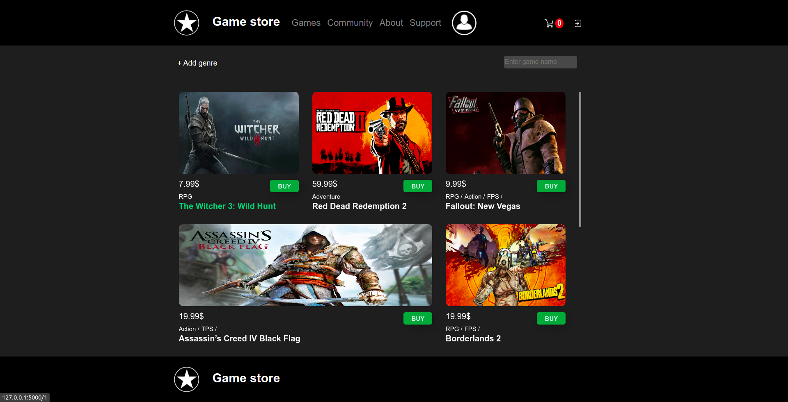

*Individual game page*

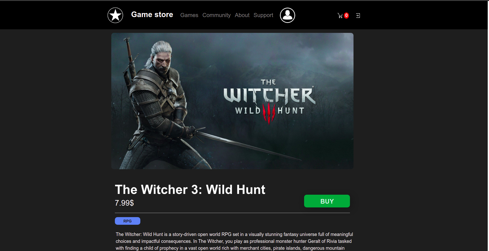

Every game has it own page with name, photo, game description, genre(s), "BUY" button and block with customers comments 
only authorized customers can leave comments. Every customer can edit or delete his own comment and reply on other users 
comments, but admins can delete, edit any comment.

*Comments*

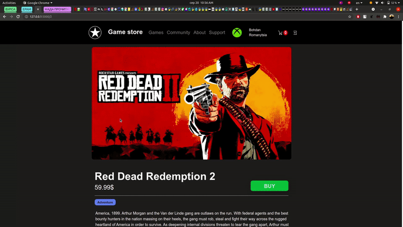

*Field for searching game by it name*

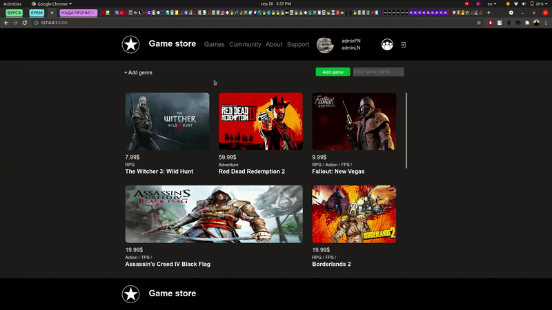

On home page we have also a field for search game by it name.

*Filter for game genres*

And we have a pop-up genre filters, where you can choose what kind of games you are searching for.

*Sign up and sign in*

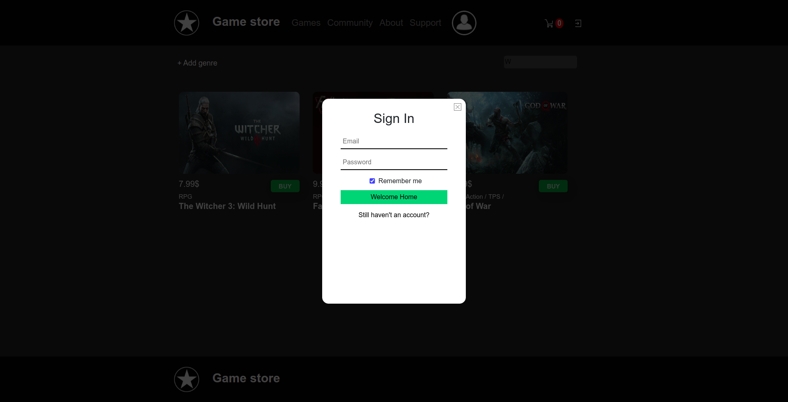

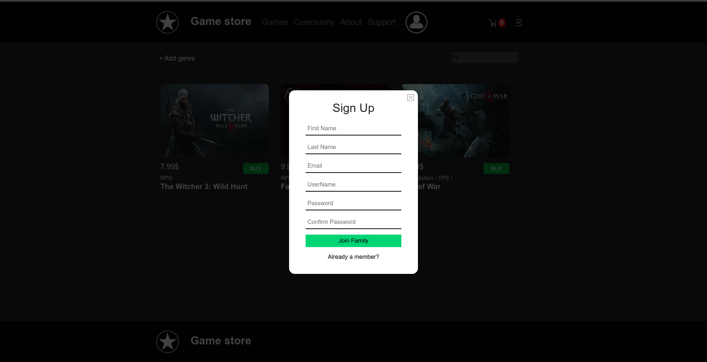

Register form has fields for first and last name, password, email and username - two last are unique.

*Sign in pop-up with such error messages*

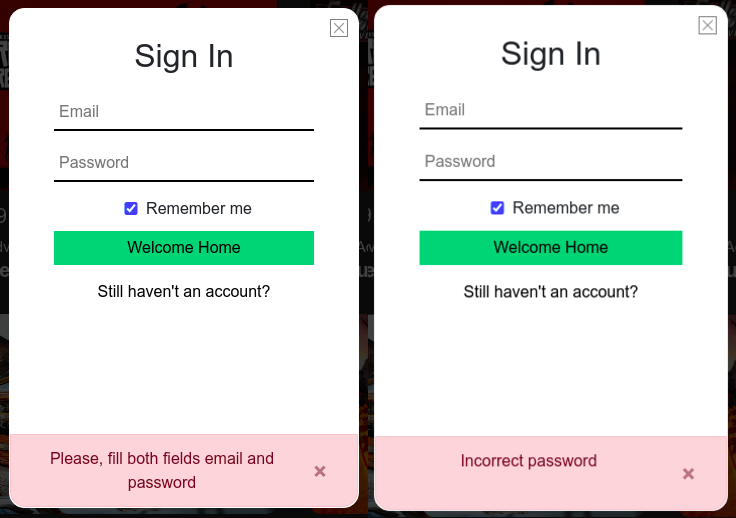

*Sign up pop-up with such error messages*

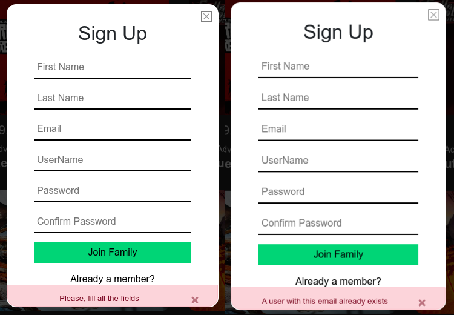

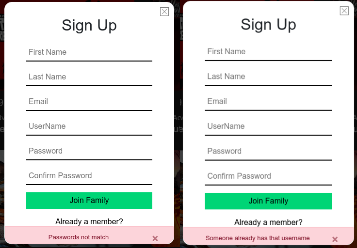

*Change profile*

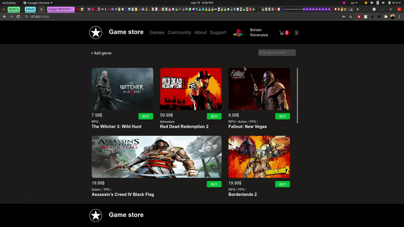

Authorized customer has an ability to change his profile data, such as first, last name and photo.

*Cart*

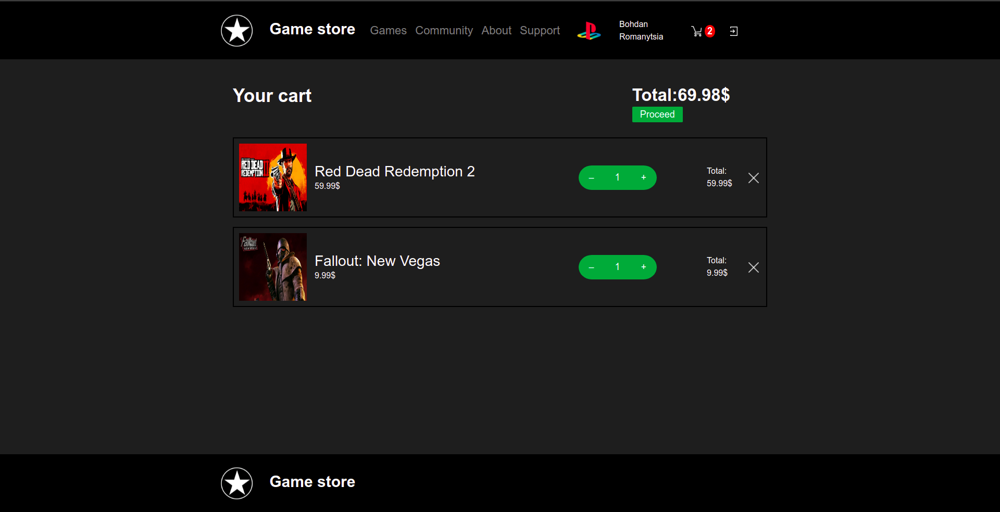

*Add games to the cart*

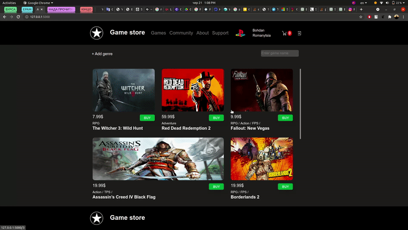

Authorized and anonymous users can add games to the cart, clicking on "BUY" button on individual or home page.
They also have an ability to change number of copies clicking on plus or minus icons in cart or delete game and
his copies by one click.

*Order*

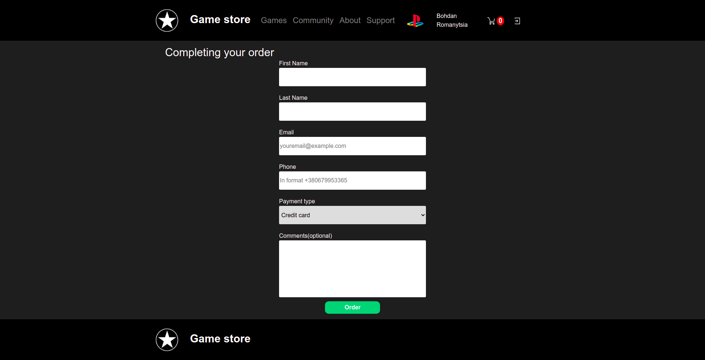

After you finished your shopping we need to complete your order. We need a little bit more information about you for this. 
Phone, email and payment type are required fields.

*Order without games in cart*

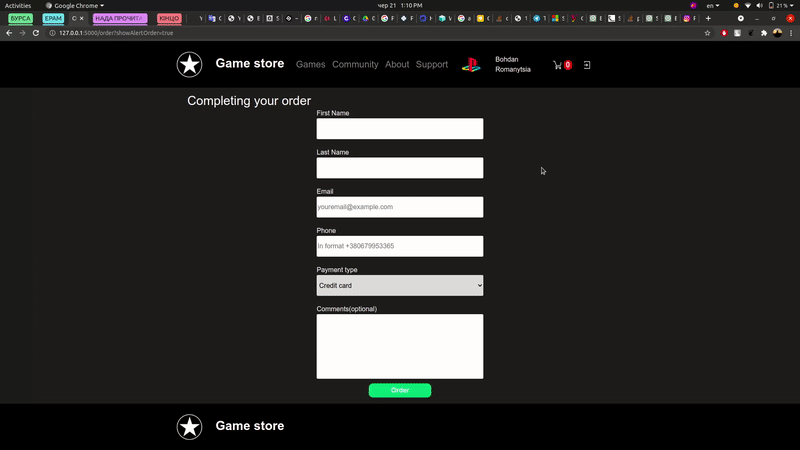

You can't make an order without any game in a cart.

*Regular order and email with your purchase*

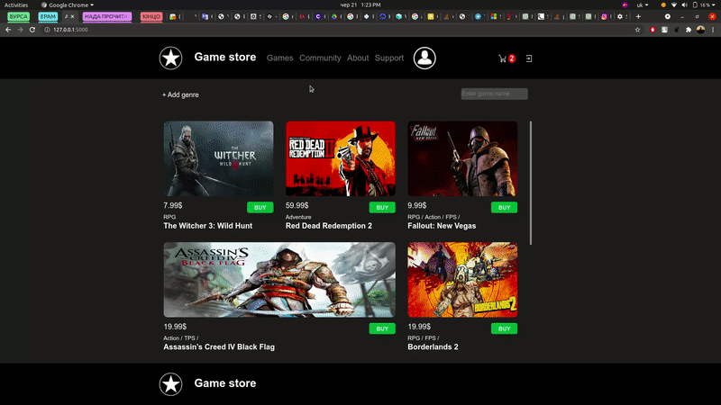

If you make everything right we will send check to your email.

<h3>__FOR ADMINS__</h3>

*Admin hover with edit and hide buttons*

When admin mouse on game hover effect with two icons will appear. First ico is pencil after click on it, 
you will be redirected on page for editing games data. The second ico is trash bin, after click on this ico game will be
hidden, if game was hidden 3 months ago data about this game will be deleted from database. Hidden game can't be purchased, only admins can see game with such status. 

*Adding game*

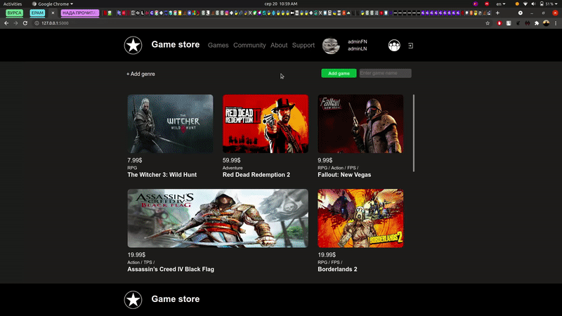

Admin can add new games. Game name, price and game description are required fields in this form. 
Game photo can be added later, by default its picture with questions mark.  

*Editing game data*

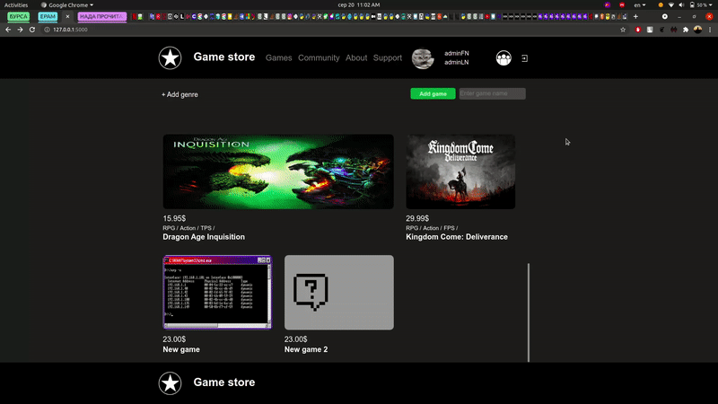

Admin also has an ability to edit existing game name, price, photo, genre(s) or description, after this form will be ready for adding new games.

*Change game quantity*

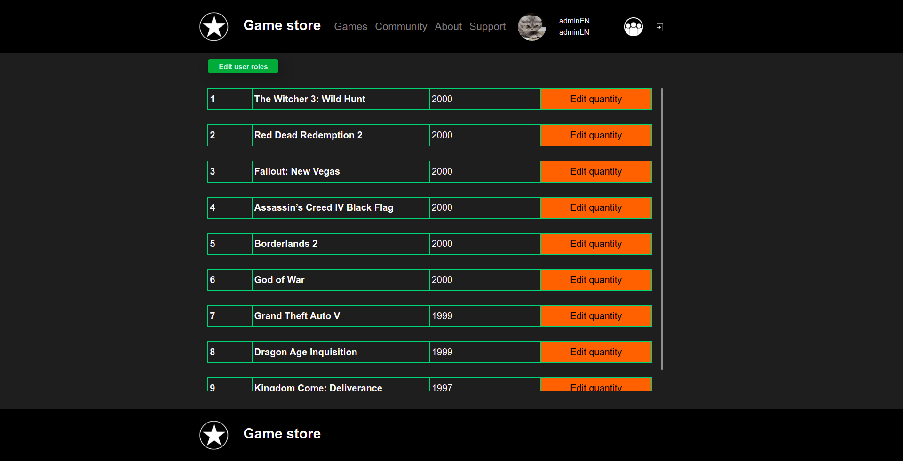

Admins can change quantity of game copies, but they can't buy games.

*Change user rules based on his role*

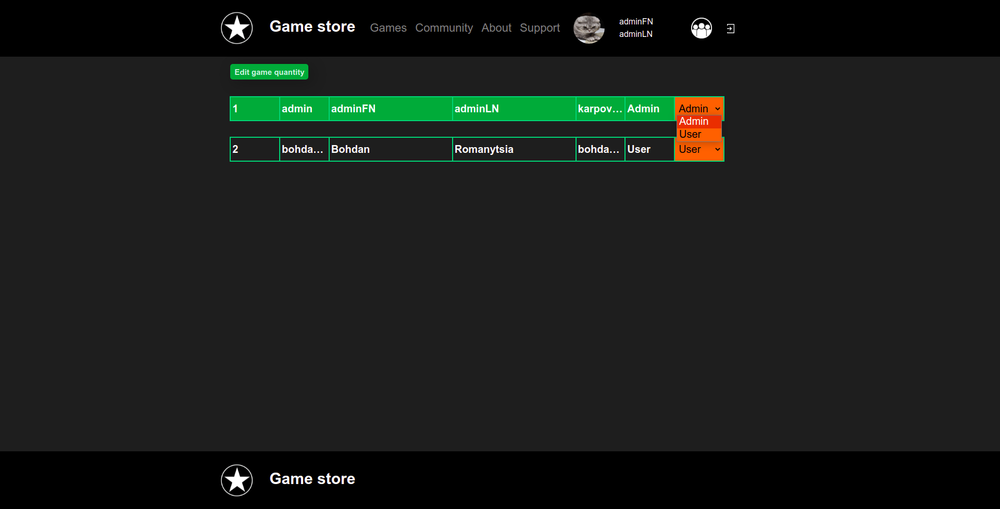

Admins also has rules for changing user permissions.

<h3>Database</h3>

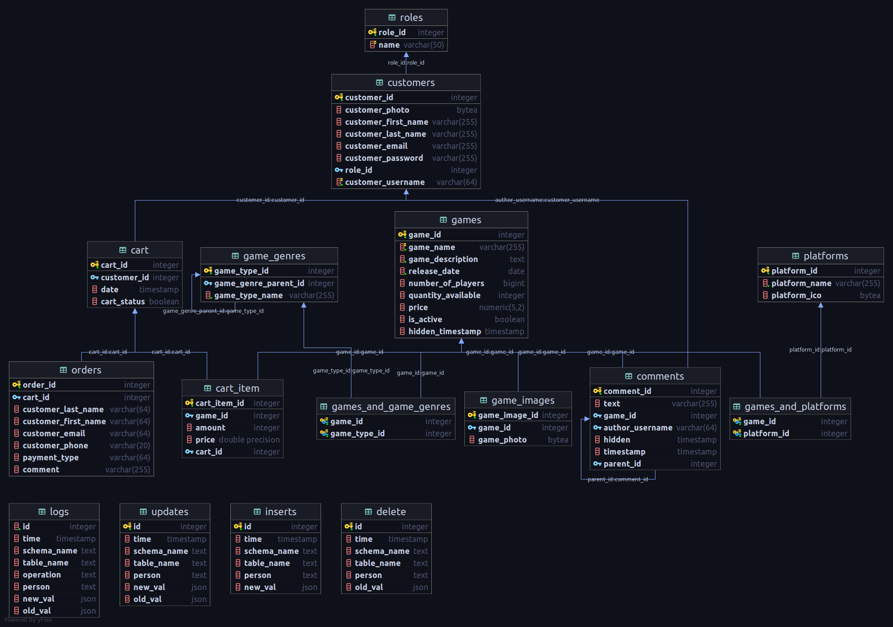

In database there are 16 tables, 4 of them for logging.

### Tech stack

Programming languages - Python, JavaScript

Back end - Flask with ORM Flask-SQLAlchemy

Front end - HTML5, CSS3, Bootstrap, JS, JQuery

RDBMS - PostgreSQL

### Installation

All python packages used in this project contains in 'requirements.txt'